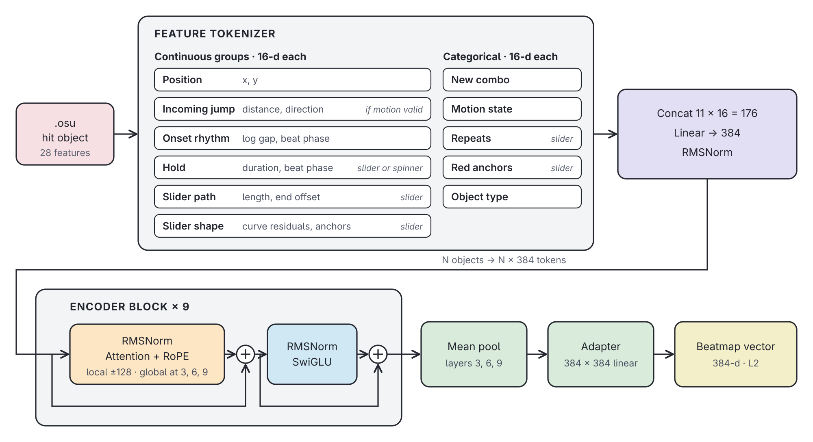

# BoBERT
**Bidirectional osu! Beatmap Encoder Representations from Transformers**

BoBERT learns dense representations of osu!standard beatmaps from their hit-object sequences. Spatial patterns, rhythm, and slider geometry become fixed-size embeddings. The encoder was pretrained on roughly **500,000 beatmaps**, then adapted for recommendation and similarity search using labelled data from thousands of collections.

While recommendation and similarity search motivated the project, the pretrained embeddings can be adapted to a wider range of representation-learning tasks, including classification, clustering, and attribute prediction. The repository includes the data pipeline, encoder training and adaptation, evaluation tools, and a web application.

**[Try the beatmap recommender →](https://bobert-web.pages.dev/)**

## Architecture

BoBERT is a bidirectional Transformer inspired by [ModernBERT](https://arxiv.org/abs/2412.13663), adapted to structured beatmap features. It combines local attention for nearby patterns with periodic global attention across the beatmap, producing a 384-dimensional representation.



### Dense feature tokens

Each hit object is described by spatial, rhythmic, slider-geometry, and categorical features. An [FT-Transformer](https://arxiv.org/abs/2106.11959)-inspired tokenizer embeds related feature groups and combines them into a single dense vector: **one hit object becomes one sequence token**. This preserves continuous measurements while keeping sequences compact.

Feature extraction lives in [`core/features.py`](core/features.py), and the tokenizer in [`core/components.py`](core/components.py).

### Sequence encoder

| Setting | Default in [`configs/default.yaml`](configs/default.yaml) |
| --- | --- |
| Encoder depth / width | 9 layers / 384 dimensions |
| Attention heads | 6 |
| Sequence length limit | 4,096 hit objects |
| Attention pattern | Global every third layer; local otherwise, ±128 objects |
| Positional representation | Rotary position embeddings (RoPE) |

FlashAttention 2 and packed variable-length sequences reduce padding overhead during GPU training. A PyTorch attention path supports CPU inference. The encoder implementation is in [`core/model.py`](core/model.py).

### Learning and embedding extraction

Pretraining masks spans of hit objects and learns to reconstruct their features. An auxiliary objective predicts aim, speed, and related strain targets, encouraging the model to capture both local patterns and map-level characteristics.

For retrieval, representations from the global-attention layers are pooled, centered, and combined into a normalized beatmap embedding. A lightweight linear adapter learns from collection-derived positive pairs to refine similarity for recommendations.

## Limitations

- **Short maps can have less reliable neighbors.** Each token summarizes its surrounding patterns and, through global attention, wider map context. Mean pooling compresses these representations into one vector. Maps with fewer hit objects provide fewer observations to average over, so their neighborhoods can be sparser and noisier.
- **Pooling loses detail.** A single embedding summarizes the whole map; distinctive short sections can be diluted by more common patterns elsewhere. Map-level similarity does not necessarily imply that every section plays similarly.
- **Long maps are truncated.** Only the first 4,096 hit objects are encoded; later objects are currently discarded. Pooling embeddings from multiple segments is a possible extension for extremely long maps.
- **Only osu!standard is supported.** Other game modes would require extending the feature tokenizer and masked-feature prediction heads, along with mode-specific data preparation and training.
- **Uncached CPU inference can be slow.** Encoding the longest supported maps can take several seconds, depending on hardware. GPU-precomputed embeddings and cached online results make this less frequent, but previously unseen maps still incur the encoding cost.

## Run locally

The API runs on CPU in Docker; the frontend uses Bun. Local development connects Vite directly to the API.

### Prepare artifacts

Download a versioned model, embedding index, and metadata catalogs from [Hugging Face](https://huggingface.co/token03/bobert):

```sh
uv run --no-default-groups --group serve fetch-run --revision v13.2
```

This uses CPU dependencies, installs the run artifacts under `runs/`, and places the metadata catalogs in `data/`:

```text
data/
  beatmaps.parquet
  beatmapsets.parquet
  strains.parquet
runs/
  current -> <run>
  <run>/
    model.safetensors
    embeddings.parquet
    training.yaml
```

The catalogs are shared across runs; re-fetching a release overwrites them. Model, index, and training config stay together per run.

### Start the API and frontend

Copy [`.env.example`](.env.example) to `.env` and set `OSU_CLIENT_ID` and `OSU_CLIENT_SECRET` using an [osu! OAuth application](https://osu.ppy.sh/home/account/edit). From the repository root:

```sh
docker compose up --build api
```

The API is available at `http://127.0.0.1:8008`; interactive documentation is at `/api/docs`. See the [server guide](server/README.md) for configuration and endpoints.

From `web/`:

```sh
bun install
bun run dev
```

Open the address printed by Vite. After installing frontend dependencies, `mise run dev` starts both development services from the repository root. See [web development](web/README.md).

## Training and exploration

The Python development environment targets **Linux x86-64, Python 3.12, PyTorch 2.11, and CUDA 12.8**, with a pinned FlashAttention wheel. Install it with [uv](https://docs.astral.sh/uv/):

```sh
uv sync --frozen
uv run pretrain --help
```

After preparing the dataset and strain targets, train with a named run:

```sh
uv run pretrain --config configs/default.yaml --full -v my-run
uv run embed -v my-run
```

Pretraining saves a run configuration and exports `model.safetensors`. `export-model` also exports existing checkpoints. `adapt` trains the embedding adapter; `evaluate`, `mine`, and `umap` support retrieval analysis and exploration. The [scripts guide](scripts/README.md) maps each command to its inputs and outputs.

`uv sync` installs the default CUDA training group. For CPU serving and release downloads, use `uv sync --no-default-groups --group serve`. Both environments are resolved in `uv.lock`.

## Repository guide

| Directory | Purpose |
| --- | --- |
| [`core/`](core/) | Beatmap parsing, features, encoder, and dataset primitives |
| [`training/`](training/) | Lightning modules, data loading, objectives, and optimizers |
| [`scripts/`](scripts/README.md) | Data acquisition, dataset construction, training entry points, and evaluation |
| [`server/`](server/README.md) | FastAPI application, retrieval runtime, and online embedding cache |
| [`web/`](web/README.md) | React application and Cloudflare gateway |
| `data/`, `runs/`, `cache/` | Local datasets, model artifacts, and runtime state |

## Acknowledgements and references

- [MusicBERT](https://arxiv.org/abs/2106.05630): a major inspiration for representation learning from structured musical sequences.
- [CM3P](https://github.com/OliBomby/CM3P) by OliBomby: inspiration for the encoder architecture.
- [ModernBERT](https://github.com/AnswerDotAI/ModernBERT): efficient bidirectional encoders with rotary embeddings and alternating attention.
- [FT-Transformer](https://github.com/yandex-research/rtdl-revisiting-models): feature-wise embeddings for numerical and categorical inputs.
- [osu!collector](https://osucollector.com/) and [osu!stats](https://osustats.ppy.sh/): labelled collection data used for adaptation and evaluation.
- [Beatconnect](https://beatconnect.io/): `.osu` files used to build the dataset.
- [osu!](https://osu.ppy.sh/) and its mapping community: beatmaps and metadata underlying the project.

## License

Code is available under the [MIT License](LICENSE).
