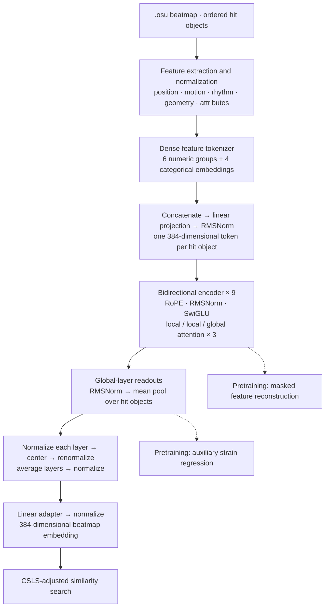

# BoBERT
**Bidirectional osu! Beatmap Encoder Representations from Transformers**

BoBERT learns dense representations of osu!standard beatmaps from their hit-object sequences. Spatial patterns, rhythm, and slider geometry become fixed-size embeddings for similarity search, recommendations, and representation analysis. The project includes a data pipeline, encoder training and adaptation, evaluation tools, and a web application backed by an index of roughly 500,000 beatmaps.

**The model operates solely on `.osu` files**, using the structured beatmap data to produce embeddings without audio or spectrogram inputs.

## Architecture

BoBERT is a bidirectional Transformer inspired by [ModernBERT](https://arxiv.org/abs/2412.13663): rotary position embeddings, interleaved local/global attention, and packed variable-length execution. Its input representation and prediction heads are designed for structured beatmap features. The encoder uses pre-norm RMSNorm and SwiGLU feed-forward blocks.

The project draws heavily on [MusicBERT](https://arxiv.org/abs/2106.05630) as inspiration for learning representations from structured musical sequences, and on [CM3P](https://github.com/OliBomby/CM3P) for its encoder architecture.



### Dense feature tokens

[`core/osu.py`](core/osu.py) parses hit objects and timing information; [`core/features.py`](core/features.py) constructs normalized continuous and categorical features. These include position, jump distance and direction, onset intervals and rhythmic phase, sustain duration, slider span geometry, curve residuals, and object attributes.

The tokenizer in [`core/components.py`](core/components.py) follows the feature-wise embedding idea of [FT-Transformer](https://arxiv.org/abs/2106.11959), adapted to groups of related measurements. Each numeric group has its own learned projection with a zero-centered nonlinearity, `tanh(Wx + b) − tanh(b)`. Object-type and validity masks suppress inapplicable features. Geometry projections are combined into two groups, giving six numeric embeddings alongside four categorical embeddings.

Each group is 16-dimensional in the default configuration. The ten groups are concatenated into a 160-dimensional vector, projected to width 384, and RMS-normalized. **One hit object becomes one sequence token**; feature groups are fused within that token. Continuous measurements are preserved without expanding them into a discrete event vocabulary.

### Sequence encoder

| Setting | Default in [`config.yaml`](config.yaml) |
| --- | --- |
| Encoder depth / width | 9 layers / 384 dimensions |
| Attention heads | 6 |
| SwiGLU intermediate width | 1,024 |
| Sequence length limit | 4,096 hit objects |
| Global attention | Layers 3, 6, and 9 |
| Local attention | Other layers, up to 128 objects on either side |
| Positional representation | Rotary position embeddings (RoPE) |
| Residual blocks | Pre-norm RMSNorm, bias-free attention and feed-forward projections |

Local attention models nearby patterns while periodic global layers exchange information across the beatmap. CUDA execution uses FlashAttention 2's variable-length kernels. Sequences are packed with cumulative sequence offsets, preserving beatmap boundaries without padding every map to the longest sequence. A PyTorch attention implementation supports CPU inference. Training also supports `torch.compile`, length bucketing, mixed precision, and activation checkpointing.

### Learning and embedding extraction

Pretraining masks spans of hit objects and reconstructs their continuous and categorical features with feature-specific heads. The default mask ratio is 30%, with a mean span length of two objects. An auxiliary head predicts aim, speed, and related strain targets from pooled encoder states. These objectives encourage both local pattern reconstruction and map-level representations.

For retrieval, BoBERT mean-pools normalized hidden states at each global-attention layer. It L2-normalizes each layer's pooled vector, subtracts its corpus mean, renormalizes, averages across layers, and normalizes the result. A linear adapter can then be trained with collection-derived positive pairs and a symmetric in-batch contrastive objective. Final embeddings are indexed with a density-adjusted CSLS scoring rule, used primarily to reduce the disproportionate influence of maps with more hit objects. This correction operates on embedding-neighborhood density rather than directly penalizing hit-object count.

The corpus centering statistics and retrieval settings belong to the exported embedding index: online queries must use the same transform as the stored vectors.

## Run locally

The API runs on CPU in Docker; the frontend uses Bun. Local development connects Vite directly to the API.

### Prepare artifacts

The current checkout expects an exported model, its matching embedding index, and metadata catalogs. Build these with the [pipeline tools](scripts/README.md), or use a matching run supplied separately. Model weights and datasets are not included in Git.

```text
data/
  beatmaps.parquet
  beatmapsets.parquet
  strains.parquet
runs/
  current -> <run>
  <run>/
    bobert.pt
    embeddings.parquet
    embeddings.json
```

### Start the API and frontend

Copy [`.env.example`](.env.example) to `.env` and set `OSU_CLIENT_ID` and `OSU_CLIENT_SECRET` using an [osu! OAuth application](https://osu.ppy.sh/home/account/edit). From the repository root:

```sh
docker compose up --build api
```

The API is available at `http://127.0.0.1:8008`; interactive documentation is at `/api/docs`. See the [server guide](server/README.md) for configuration and endpoints.

From `web/`:

```sh
bun install
bun run dev
```

Open the address printed by Vite. After installing frontend dependencies, `mise run dev` starts both development services from the repository root. See [web development](web/README.md).

## Training and exploration

The Python development environment targets **Linux x86-64, Python 3.12, PyTorch 2.11, and CUDA 12.8**, with a pinned FlashAttention wheel. Install it with [uv](https://docs.astral.sh/uv/):

```sh
uv sync --frozen
uv run pretrain --help
```

After preparing the dataset and strain targets, train with a named run:

```sh
uv run pretrain --config config.yaml --full -v my-run
uv run embed -v my-run
```

Pretraining saves a run configuration and exports `bobert.pt`. `export-model` also exports existing checkpoints. `adapt` trains the embedding adapter; `evaluate`, `mine`, and `umap` support retrieval analysis and exploration. The [scripts guide](scripts/README.md) maps each command to its inputs and outputs.

## Repository guide

| Directory | Purpose |
| --- | --- |
| [`core/`](core/) | Beatmap parsing, features, encoder, and dataset primitives |
| [`training/`](training/) | Lightning modules, data loading, objectives, and optimizers |
| [`scripts/`](scripts/README.md) | Data acquisition, dataset construction, training entry points, and evaluation |
| [`server/`](server/README.md) | FastAPI application, retrieval runtime, and online embedding cache |
| [`web/`](web/README.md) | React application and Cloudflare gateway |
| `data/`, `runs/`, `cache/` | Local datasets, model artifacts, and runtime state |

## Acknowledgements and references

- [MusicBERT](https://arxiv.org/abs/2106.05630): a major inspiration for representation learning from structured musical sequences.
- [CM3P](https://github.com/OliBomby/CM3P) by OliBomby: inspiration for the encoder architecture.
- [ModernBERT](https://github.com/AnswerDotAI/ModernBERT): efficient bidirectional encoders with rotary embeddings and alternating attention.
- [FT-Transformer](https://github.com/yandex-research/rtdl-revisiting-models): feature-wise embeddings for numerical and categorical inputs.
- [osu!collector](https://osucollector.com/) and [osu!stats](https://osustats.ppy.sh/): labelled collection data used for adaptation and evaluation.
- [Beatconnect](https://beatconnect.io/): `.osu` files used to build the dataset.
- [osu!](https://osu.ppy.sh/) and its mapping community: beatmaps and metadata underlying the project.

## License

Code is available under the [MIT License](LICENSE).
